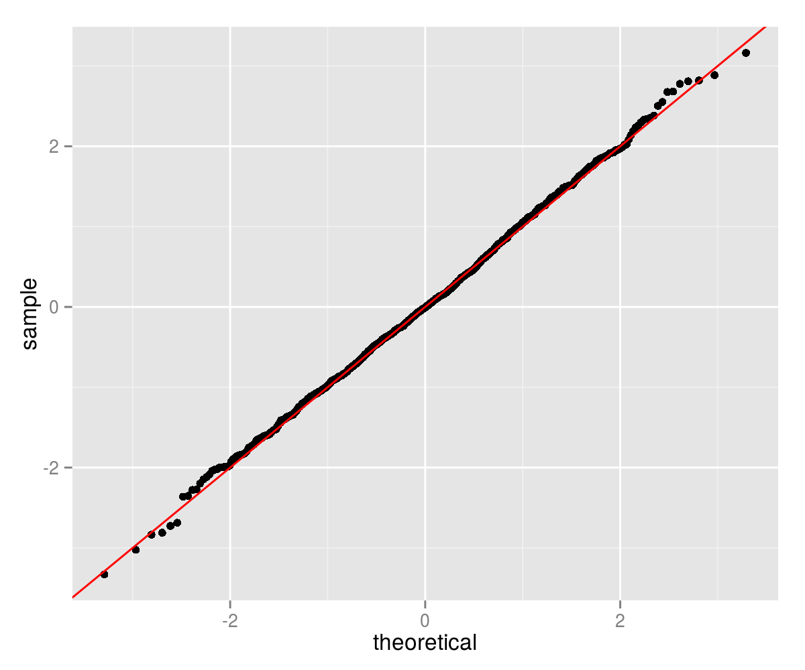
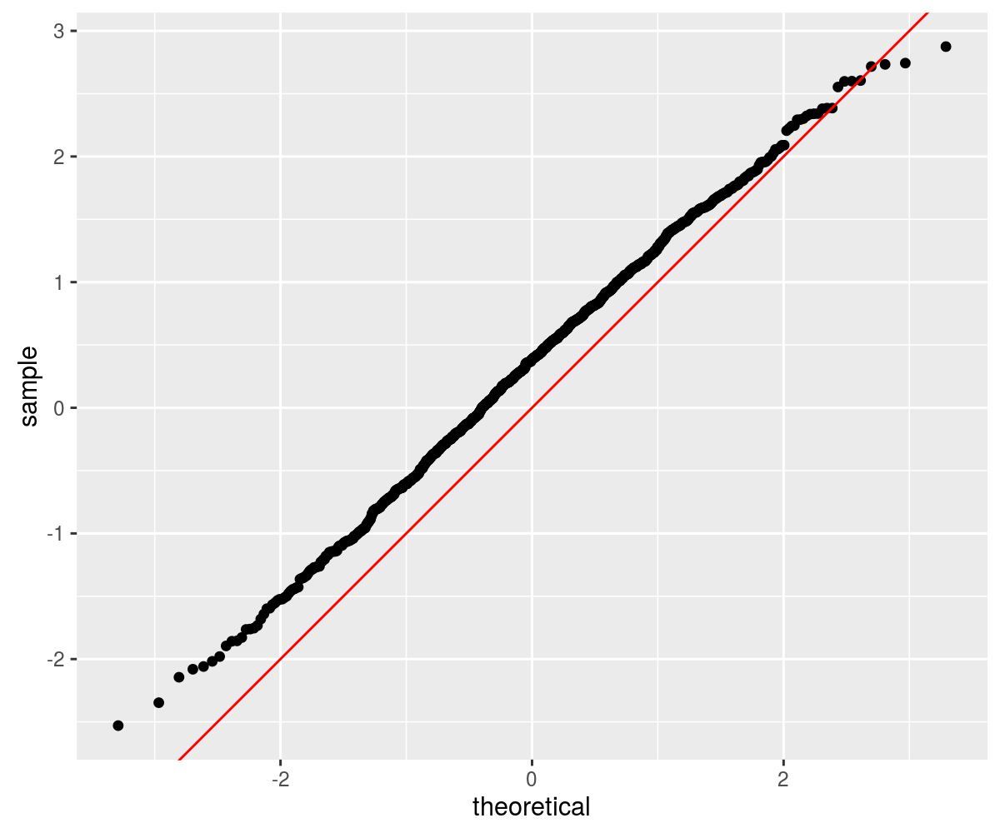

# madness

[](https://travis-ci.org/shabbychef/madness)
[](http://codecov.io/github/shabbychef/madness?branch=master)
[](http://cran.rstudio.com/package=madness) 
[](http://www.r-pkg.org/pkg/madness)

'madness' is a 'Multivariate Automatic Differentiation' package for R. It allows one to compute and track the derivative of 
multivariate to multivariate functions applied to concrete data via forward differentiation and the chain rule. 
The obvious use cases are for computing approximate standard errors via the Delta method, possibly for optimization
of objective functions over vectors of parameters, and party tricks. 

-- Steven E. Pav, shabbychef@gmail.com

## Installation

This package is not yet on CRAN; the latest version may be
found on [github](https://www.github.com/shabbychef/madness "madness")
via devtools, or installed via [drat](https://github.com/eddelbuettel/drat "drat"):


```r
# via CRAN (not yet): install.packages('madness')
# via drat:
if (require(drat)) {
    drat:::add("shabbychef")
    install.packages("madness")
}
# via devtools
if (require(devtools)) {
    install_github("shabbychef/madness")
}
```

# Basic Usage

You can store an initial value in a `madness` object, 
its derivative with respect to the independent variable, along with the 
'name' of the dependent and independent variables, and an optional 
variance-covariance matrix of the independent variable. These are mostly
filled in with sane defaults (the derivative defaults to the identity
matrix, and so on):


```r
require(madness)
set.seed(1234)
x <- matrix(rnorm(16), ncol = 2)
madx <- madness(x, vtag = "y", xtag = "x")
# the show method could use some work
print(madx)
```

```
## class: madness 
##         d y
##  calc: ----- 
##         d x
##   val: -1.2 -0.56 ...
##  dvdx: 1 0 0 0 0 0 0 0 0 0 0 0 0 0 0 0 ...
##  varx:  ...
```

You can then perform operations on objects and the derivative will be propagated
forward via the chain rule:


```r
madx2 <- cbind(crossprod(2 * madx), diag(2))
print(madx2)
```

```
## class: madness 
##         d cbind((t((numeric * y)) %*% (numeric * y)), numeric)
##  calc: -------------------------------------------------------- 
##                                   d x
##   val: 37 5.9 1 0 ...
##  dvdx: -9.7 2.2 8.7 -19 3.4 4 -4.6 -4.4 0 0 0 0 0 0 0 0 ...
##  varx:  ...
```

```r
madx3 <- colSums(madx2)
print(madx3)
```

```
## class: madness 
##         d colSums(cbind((t((numeric * y)) %*% (numeric * y)), numeric))
##  calc: ----------------------------------------------------------------- 
##                                       d x
##   val: 43 ...
##  dvdx: -12 -1.3 6.8 -23 0.33 4.3 -0.76 -4.8 -4.8 1.1 4.3 -9.4 1.7 2 -2.3 -2.2 ...
##  varx:  ...
```

```r
madx4 <- norm(log(abs(1 + madx2^2)), "F")
print(madx4)
```

```
## class: madness 
##         d norm(log(abs((numeric + (cbind((t((numeric * y)) %*% (numeric * y)), numeric) ^ numeric)))), 'f')
##  calc: ----------------------------------------------------------------------------------------------------- 
##                                                         d x
##   val: 10 ...
##  dvdx: -0.87 -0.72 -0.11 -1.6 -0.58 0.21 0.7 -0.26 -1.4 -0.23 0.72 -2.7 -0.031 0.49 -0.0021 -0.56 ...
##  varx:  ...
```

## Variance-Covariance

You can optionally attach the variance-covariance matrix of the 'X' variable to a 
`madness` object. Then the estimated variance-covariance of computed quantities
can be retrieved via the `vcov` method:


```r
set.seed(456)
# create some fake data:
nobs <- 1000
adf <- data.frame(x = rnorm(nobs), y = runif(nobs), 
    eps = rnorm(nobs))
adf$z <- 2 * adf$x - 3 * adf$y + 0.5 * adf$eps
# perform linear regression on it
lmod <- lm(z ~ x + y, data = adf)
# guess what? you can stuff it into a madness
# directly
amad <- as.madness(lmod)
print(vcov(amad))
```

```
##          [,1]     [,2]     [,3]
## [1,]  0.00096 -2.0e-05 -1.4e-03
## [2,] -0.00002  2.5e-04  1.2e-05
## [3,] -0.00145  1.2e-05  2.9e-03
```

```r
# now, say, take the norm
mynorm <- sqrt(crossprod(amad))
print(mynorm)
```

```
## class: madness 
##         d sqrt((t(val) %*% val))
##  calc: -------------------------- 
##                   d val
##   val: 3.6 ...
##  dvdx: 0.0037 0.55 -0.83 ...
##  varx: 0.00096 -2e-05 -0.0014 ...
```

```r
print(vcov(mynorm))
```

```
##        [,1]
## [1,] 0.0021
```

# Markowitz portfolio

There are two utilities for easily computing `madness` objects representing the first two moments of an object.
Here we use these to compute the Markowitz portfolio of some assets, along with the estimated variance-covariance
of the same. Here I first download the weekly simple returns of the Fama French three factors. (Note that you cannot
directly invest in these, except arguably 'the market'. The point of the example is to use realistic returns, not provide
investing advice.)


```r
# the Quandl package is better, but dealing with
# the auth is a PITA:
library(curl)
ffweekly <- read.csv(curl("https://www.quandl.com/api/v3/datasets/KFRENCH/FACTORS_W.csv"))
ffrets <- 0.01 * ffweekly[, c("Mkt.RF", "SMB", "HML")]
```

Now compute the first two moments via `twomoments` and compute the Markowitz portfolio

```r
twom <- twomoments(ffrets)
markowitz <- solve(twom$Sigma, twom$mu)
print(val(markowitz))
```

```
##      [,1]
## [1,]  1.3
## [2,]  1.3
## [3,]  2.2
```

```r
print(vcov(markowitz))
```

```
##        [,1]    [,2]    [,3]
## [1,]  0.303 -0.0478 -0.1436
## [2,] -0.048  0.9924  0.0057
## [3,] -0.144  0.0057  0.7508
```

```r
wald <- val(markowitz)/sqrt(diag(vcov(markowitz)))
print(wald)
```

```
##      [,1]
## [1,]  2.4
## [2,]  1.3
## [3,]  2.5
```

## Does that really work?

I don't know. Let's perform a bunch of simulations to see if the Wald statistics are OK. We will
create a population with 5 stocks where the true Markowitz portfolio is -2,-1,0,1,2.  We will
perform 1000 simulations of 1250 days of returns from that population, computing the Markowitz
portfolio each time. Then take the difference between the estimated and true Markowitz portfolios,
divided by the standard errors. 


```r
genrows <- function(nsim, mu, haSg) {
    p <- length(mu)
    X <- matrix(rnorm(nsim * p), nrow = nsim, ncol = p) %*% 
        haSg
    X <- t(rep(mu, nsim) + t(X))
}

true.mp <- array(seq(-2, 2))
dim(true.mp) <- c(length(true.mp), 1)
p <- length(true.mp)
set.seed(92385)
true.Sigma <- 0.00017 * (3/(p + 5)) * crossprod(matrix(runif((p + 
    5) * p, min = -1, max = 1), ncol = p))
true.mu <- true.Sigma %*% true.mp
haSigma <- chol(true.Sigma)

nsim <- 1000
ndays <- 1250
set.seed(23891)
retv <- replicate(nsim, {
    X <- genrows(ndays, true.mu, haSigma)
    twom <- twomoments(X)
    markowitz <- solve(twom$Sigma, twom$mu)
    marginal.wald <- (val(markowitz) - true.mp)/sqrt(diag(vcov(markowitz)))
})
retv <- aperm(retv, c(1, 3, 2))
```

This should be approximately normal, so we Q-Q plot against
normality. LGTM.


```r
require(ggplot2)
ph <- qplot(sample = retv[1, , 1], stat = "qq") + geom_abline(intercept = 0, 
    slope = 1, colour = "red")
print(ph)
```



# Maximum eigenvalue of the covariance matrix

Consider the case of a 10-vector drawn from a population with covariance matrix whose largest eigenvalue 
is, say, 17.  
One observes some fixed number of independent observations of the 10-vector, and
computes the sample covariance matrix, then computes the maximum eigenvalue. Using a
`madness` object, one can automagically estimate the standard error via the delta method.
The sample calculation looks as follows:


```r
genrows <- function(nsim, mu, haSg) {
    p <- length(mu)
    X <- matrix(rnorm(nsim * p), nrow = nsim, ncol = p) %*% 
        haSg
    X <- t(rep(mu, nsim) + t(X))
}

p <- 10
set.seed(123950)
true.mu <- array(rnorm(p), dim = c(p, 1))
true.maxe <- 17
true.Sigma <- diag(c(true.maxe, runif(p - 1, min = 1, 
    max = 16)))
haSigma <- chol(true.Sigma)

ndays <- 1250

X <- genrows(ndays, true.mu, haSigma)
twom <- twomoments(X)
maxe <- maxeig(twom$Sigma)
print(maxe)
```

```
## class: madness 
##         d maxeig(Sigma)
##  calc: ----------------- 
##               d X
##   val: 18 ...
##  dvdx: 0 1.6 0.0069 -0.16 0.051 -0.0065 0.051 -0.0024 0.032 -0.035 -0.05 0.99 0.0087 -0.2 0.064 -0.0082 0.065 -0.003 0.041 -0.044 -0.062 1.9e-05 -0.00088 0.00028 -3.6e-05 0.00028 -1.3e-05 0.00018 -0.00019 -0.00027 0.01 -0.0064 0.00083 -0.0065 0.00031 -0.0041 0.0045 0.0063 0.001 -0.00026 0.0021 -9.7e-05 0.0013 -0.0014 -0.002 1.7e-05 -0.00027 1.3e-05 -0.00017 0.00018 0.00026 0.001 -9.9e-05 0.0013 -0.0014 -0.002 2.3e-06 -6.2e-05 6.8e-05 9.5e-05 0.00041 -0.00091 -0.0013 5e-04 0.0014 0.00097 ...
##  varx: 2.3e-32 9.1e-20 4.1e-19 1.7e-19 1.5e-19 -1.1e-19 -1.1e-19 2.5e-19 -7.2e-20 -4.1e-19 -1.6e-19 1.9e-18 -5.8e-19 -2.9e-19 -1.9e-19 2.2e-19 2e-19 -3.8e-19 1.6e-19 6.2e-19 1.4e-19 5.6e-19 -2.5e-19 -4.2e-19 6.2e-19 5.2e-19 -8.5e-19 3.1e-19 1.4e-18 3.4e-19 1.3e-18 -7.9e-20 2.2e-19 6.3e-20 -1.7e-19 1.4e-19 3.6e-19 6.5e-20 1.5e-18 2.2e-19 1.8e-19 -2.7e-19 7.1e-20 5.7e-19 1e-19 5.8e-20 -2e-19 4.2e-19 -1.5e-19 -7.3e-19 -2.3e-19 1.4e-18 2.5e-19 -1e-19 -4.8e-19 -1.7e-19 4.1e-19 1.8e-19 9.9e-19 2.7e-19 8.6e-19 -3.8e-19 -1.1e-19 -4.3e-19 -4.2e-19 1.4e-19 ...
```

```r
print(vcov(maxe))
```

```
##      [,1]
## [1,] 0.54
```

Now perform some simulations to see if these are accurate:


```r
nsim <- 500
set.seed(23401)
retv <- replicate(nsim, {
    X <- genrows(ndays, true.mu, haSigma)
    twom <- twomoments(X)
    maxe <- maxeig(twom$Sigma)
    marginal.wald <- (val(maxe) - true.maxe)/sqrt(diag(vcov(maxe)))
})
require(ggplot2)
ph <- qplot(sample = as.numeric(retv), stat = "qq") + 
    geom_abline(intercept = 0, slope = 1, colour = "red")
print(ph)
```

 

Why the bias? There are a number of possibilities:

1. Broken example. Am I really checking what I intended?
2. Broken derivative code. Easy to check.
3. Failure to take symmetry into account.
4. Sample size not large enough. (ha ha.)
5. Derivative equal or near zero, requiring second term expansion in delta method.

# Enough already, bring me some Scotch!

An example is in order. Consider the tasting data compiled by Nessie on 86 Scotch whiskies. The data
are availble online and look like so:


```r
library(curl)
wsky <- read.csv(curl("https://www.mathstat.strath.ac.uk/outreach/nessie/datasets/whiskies.txt"), 
    stringsAsFactors = FALSE)
kable(head(wsky))
```


| RowID|Distillery  | Body| Sweetness| Smoky| Medicinal| Tobacco| Honey| Spicy| Winey| Nutty| Malty| Fruity| Floral|Postcode | Latitude| Longitude|
|-----:|:-----------|----:|---------:|-----:|---------:|-------:|-----:|-----:|-----:|-----:|-----:|------:|------:|:--------|--------:|---------:|
|     1|Aberfeldy   |    2|         2|     2|         0|       0|     2|     1|     2|     2|     2|      2|      2|PH15 2EB |   286580|    749680|
|     2|Aberlour    |    3|         3|     1|         0|       0|     4|     3|     2|     2|     3|      3|      2|AB38 9PJ |   326340|    842570|
|     3|AnCnoc      |    1|         3|     2|         0|       0|     2|     0|     0|     2|     2|      3|      2|AB5 5LI  |   352960|    839320|
|     4|Ardbeg      |    4|         1|     4|         4|       0|     0|     2|     0|     1|     2|      1|      0|PA42 7EB |   141560|    646220|
|     5|Ardmore     |    2|         2|     2|         0|       0|     1|     1|     1|     2|     3|      1|      1|AB54 4NH |   355350|    829140|
|     6|ArranIsleOf |    2|         3|     1|         1|       0|     1|     1|     1|     0|     1|      1|      2|KA27 8HJ |   194050|    649950|

A bizarre question one could ask of this data are whether the taste characteristics are related
to the geographic coordinates of the distilleries? One way to pose this is to perform a linear
regression of the taste values on the geographic coordinates. This is a many-to-many regression.
The Multivariate General Linear Hypothesis is a general hypothesis about the regression coefficients
in this case. The 'usual' application is the omnibus test of whether all regression coefficients
are zero. The MGLH is classically approached by four different tests, which typically give the same
answer. 

First, we grab the geographic and taste data, prepend a one to the vector, take an outer product
and compute the mean and covariance. The MGLH statistics can be posed in terms of the eigenvalues
of a certain matrix. Here these are statistics are computed so as to equal zero under the null
hypothesis of all zero linear regression coefficient from geography to taste. We get the approximate
standard errors from the delta method, and compute Wald statistics.


```r
x <- cbind(1, 1e-05 * wsky[, c("Latitude", "Longitude")])
y <- wsky[, c("Body", "Sweetness", "Smoky", "Medicinal", 
    "Tobacco", "Honey", "Spicy", "Winey", "Nutty", 
    "Malty", "Fruity", "Floral")]
xy <- cbind(x, y)
# estimate second moment matrix:
xytheta <- theta(xy)
nfeat <- ncol(x)
ntgt <- ncol(y)
GammaB <- xytheta[1:nfeat, nfeat + (1:ntgt)]
SiB <- -solve(xytheta)[nfeat + (1:ntgt), 1:nfeat]
EH <- SiB %*% GammaB
oEH <- diag(ntgt) + EH

HLT <- matrix.trace(oEH) - ntgt
PBT <- ntgt - matrix.trace(solve(oEH))
# this is not the LRT, but log of 1/LRT. sue me.
LRT <- log(det(oEH))
RLR <- maxeig(oEH) - 1
MGLH <- c(HLT, PBT, LRT, RLR)
walds <- val(MGLH)/sqrt(diag(vcov(MGLH)))

# put them together to show them:
preso <- data.frame(type = c("HLT", "PBT", "LRT", "RLR"), 
    stat = as.numeric(MGLH), Wald.stat = as.numeric(walds))
kable(preso)
```


|type | stat| Wald.stat|
|:----|----:|---------:|
|HLT  | 66.6|       5.0|
|PBT  |  1.7|      15.6|
|LRT  |  5.2|      16.8|
|RLR  | 76.0|       4.8|

These all cast doubt on the hypothesis of 'no connection between geography and taste', although
I am accustomed to seeing Wald statistics being nearly equivalent. This is still beta code.
We also have the estimated standard error covariance of the vector of 
MGLH statistics, turned into a correlation matrix here. The four test methods have positively
correlated standard errors, meaning we should not be more confident if all four suggest
rejecting the null.


```r
print(cov2cor(vcov(MGLH)))
```

```
##      [,1] [,2] [,3] [,4]
## [1,] 1.00 0.15 0.75 0.98
## [2,] 0.15 1.00 0.75 0.11
## [3,] 0.75 0.75 1.00 0.71
## [4,] 0.98 0.11 0.71 1.00
```

# Correctness

The following are cribbed from the unit tests (of which there are never enough). First
we define the function which computes approximate derivatives numerically, then test
it on some functions:


```r
require(madness)
require(testthat)

apx_deriv <- function(xval, thefun, eps = 1e-09, type = c("forward", 
    "central")) {
    type <- match.arg(type)
    yval <- thefun(xval)
    dapx <- matrix(0, length(yval), length(xval))
    for (iii in seq_len(length(xval))) {
        xalt <- xval
        xalt[iii] <- xalt[iii] + eps
        yplus <- thefun(xalt)
        dydx <- switch(type, forward = {
            (yplus - yval)/eps
        }, central = {
            xalt <- xval
            xalt[iii] <- xalt[iii] - eps
            yneg <- thefun(xalt)
            (yplus - yneg)/(2 * eps)
        })
        dapx[, iii] <- as.numeric(dydx)
    }
    dapx
}

test_harness <- function(xval, thefun, scalfun = thefun, 
    eps = 1e-07) {
    xobj <- madness(val = xval, vtag = "x", xtag = "x")
    yobj <- thefun(xobj)
    xval <- val(xobj)
    dapx <- apx_deriv(xval, scalfun, eps = eps, type = "central")
    # compute error:
    dcmp <- dvdx(yobj)
    dim(dcmp) <- dim(dapx)
    
    merror <- abs(dapx - dcmp)
    rerror <- merror/(0.5 * pmax(sqrt(eps), (abs(dapx) + 
        abs(dcmp))))
    rerror[dapx == 0 & dcmp == 0] <- 0
    max(abs(rerror))
}

# now test a bunch:
set.seed(2015)

xval <- matrix(1 + runif(4 * 4), nrow = 4)
yval <- matrix(1 + runif(length(xval)), nrow = nrow(xval))
expect_less_than(test_harness(xval, function(x) {
    x + x
}), 1e-06)
expect_less_than(test_harness(xval, function(x) {
    x * yval
}), 1e-06)
expect_less_than(test_harness(xval, function(x) {
    yval/x
}), 1e-06)
expect_less_than(test_harness(xval, function(x) {
    x^x
}), 1e-06)
expect_less_than(test_harness(xval, function(x) {
    x %*% x
}), 1e-06)
expect_less_than(test_harness(xval, function(x) {
    x %*% yval
}), 1e-06)

expect_less_than(test_harness(abs(xval), function(x) {
    log(x)
}), 1e-06)
expect_less_than(test_harness(xval, function(x) {
    exp(x)
}), 1e-06)
expect_less_than(test_harness(abs(xval), function(x) {
    log10(x)
}), 1e-06)
expect_less_than(test_harness(xval, function(x) {
    sqrt(x)
}), 1e-06)

expect_less_than(test_harness(xval, function(x) {
    matrix.trace(x)
}, function(matx) {
    sum(diag(matx))
}), 1e-06)
expect_less_than(test_harness(xval, function(x) {
    colSums(x)
}), 1e-06)
expect_less_than(test_harness(xval, function(x) {
    colMeans(x)
}), 1e-06)

expect_less_than(test_harness(xval, function(x) {
    vec(x)
}, function(x) {
    dim(x) <- c(length(x), 1)
    x
}), 1e-06)
expect_less_than(test_harness(xval, function(x) {
    vech(x)
}, function(x) {
    x <- x[row(x) >= col(x)]
    dim(x) <- c(length(x), 1)
    x
}), 1e-06)

expect_less_than(test_harness(xval, function(x) {
    tril(x)
}, function(x) {
    x[row(x) < col(x)] <- 0
    x
}), 1e-06)
expect_less_than(test_harness(xval, function(x) {
    triu(x)
}, function(x) {
    x[row(x) > col(x)] <- 0
    x
}), 1e-06)

expect_less_than(test_harness(xval, function(x) {
    det(x)
}), 1e-06)
expect_less_than(test_harness(xval, function(x) {
    determinant(x, logarithm = TRUE)$modulus
}), 1e-06)
expect_less_than(test_harness(xval, function(x) {
    determinant(x, logarithm = FALSE)$modulus
}), 1e-06)

expect_less_than(test_harness(xval, function(x) {
    colSums(x)
}), 1e-06)
expect_less_than(test_harness(xval, function(x) {
    colMeans(x)
}), 1e-06)
expect_less_than(test_harness(xval, function(x) {
    rowSums(x)
}), 1e-06)
expect_less_than(test_harness(xval, function(x) {
    rowMeans(x)
}), 1e-06)

set.seed(2015)
zval <- matrix(0.01 + runif(4 * 100, min = 0, max = 0.05), 
    nrow = 4)
xval <- tcrossprod(zval)

expect_less_than(test_harness(xval, function(x) {
    norm(x, "O")
}), 1e-06)
expect_less_than(test_harness(xval, function(x) {
    norm(x, "I")
}), 1e-06)
# Matrix::norm does not support type '2'
expect_less_than(test_harness(xval, function(x) {
    norm(x, "2")
}, function(x) {
    base::norm(x, "2")
}), 1e-06)
expect_less_than(test_harness(xval, function(x) {
    norm(x, "M")
}), 1e-06)
expect_less_than(test_harness(xval, function(x) {
    norm(x, "F")
}), 1e-06)

expect_less_than(test_harness(xval, function(x) {
    sqrtm(x)
}), 1e-06)
```

## Symmetry

Some functions implicitly break symmetry, which could cause the differentiation
process to fail. For example, the 'chol' function is to be applied to a symmetric
matrix, but only looks at the upper triangular part, ignoring the lower triangular
part. This is demonstrated below. For the moment, the only 'solution' is to enforce
symmetry of the input. Eventually some native functionality around symmetry may
be implemented.


```r
set.seed(2015)
zval <- matrix(0.01 + runif(4 * 100, min = 0, max = 0.05), 
    nrow = 4)
xval <- tcrossprod(zval)

fsym <- function(x) {
    0.5 * (x + t(x))
}
# this will fail:
expect_less_than(test_harness(xval, function(x) {
    chol(x)
}), 1e-06)
```

```
## Error: test_harness(xval, function(x) {
##     chol(x)
## }) not less than 1e-06. Difference: -2
```

```r
# this will not:
expect_less_than(test_harness(xval, function(x) {
    chol(fsym(x))
}), 1e-06)
```

The functions `twomoments` and `theta` respect the symmetry of the quantities
being estimated.

# Warnings

This code is a proof of concept. The methods used to compute derivatives are not (yet)
space-efficient or necessarily numerically stable. User assumes all risk.

Derivatives are stored as a matrix in 'numerator layout'. That is the independent and
dependent variable are vectorized, then the derivative matrix has the same number
of columns as elements in the dependent variable. Thus the derivative of a 
3 by 2 by 5 y with respect to a 1 by 2 by 2 x is a 30 by 4 matrix.

